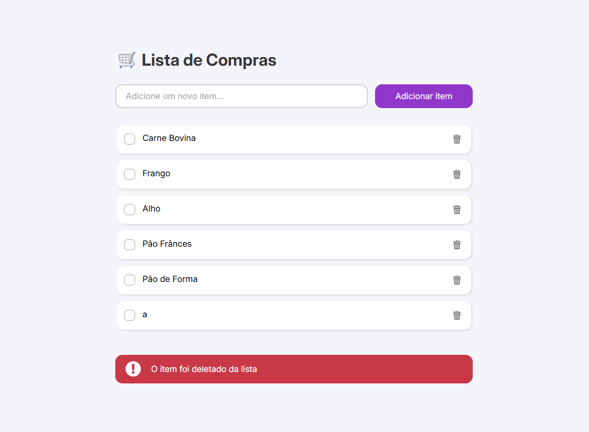
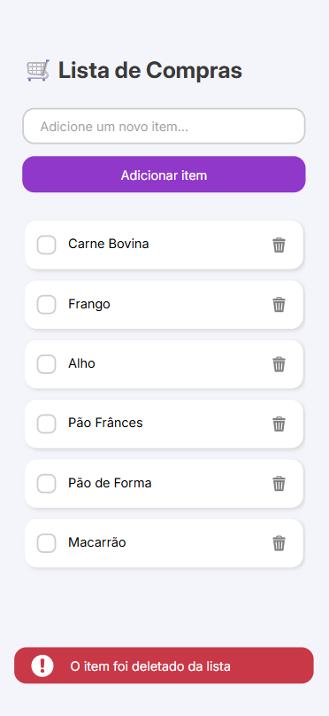

# Shopping List App 🛒

A simple and elegant Shopping List application built with pure HTML, CSS, and JavaScript. This project allows users to add, delete, and mark items as complete, with all data persistently stored in the browser's `localStorage`.

**[Live Demo](https://simeimoda.github.io/Shopping-List-App/)** 👈 (Replace with your GitHub Pages link)

---

<table>
  <tr>
    <td></td>
    <td></td>
  </tr>
</table>

---

## Features

-   **Add Items:** Easily add new items to your shopping list via the input field.
-   **Delete Items:** Remove items with a single click on the trash can icon.
-   **Mark as Complete:** Click the custom-styled checkbox to toggle a strike-through style on items.
-   **Persistent Storage:** Your list is automatically saved in your browser using `localStorage`, so your items will be there when you return.
-   **Responsive Design:** The layout is fully responsive and provides a great user experience on both desktop and mobile screens.
-   **User Feedback:** A smooth, animated alert notifies the user when an item has been deleted.
-   **Modern UI:** Features custom-styled form elements and a clean, intuitive interface.

---

## Technologies Used

This project was built using core web technologies, without any frameworks or libraries.

-   **HTML5:** For the structure and content of the application.
-   **CSS3:** For all styling, including Flexbox for layout, custom properties for theming, transitions for animations, and media queries for responsiveness.
-   **JavaScript (ES6+):** For all application logic, including DOM manipulation, event handling, and interaction with `localStorage`.

---

## How to Use

To run this project locally, simply follow these steps:

1.  **Clone the repository:**
    ```bash
    git clone https://github.com/simeimoda/Shopping-List-App.git
    ```

2.  **Navigate to the project directory:**
    ```bash
    cd Shopping-List-App
    

3.  **Open the `index.html` file in your browser.** 

---

